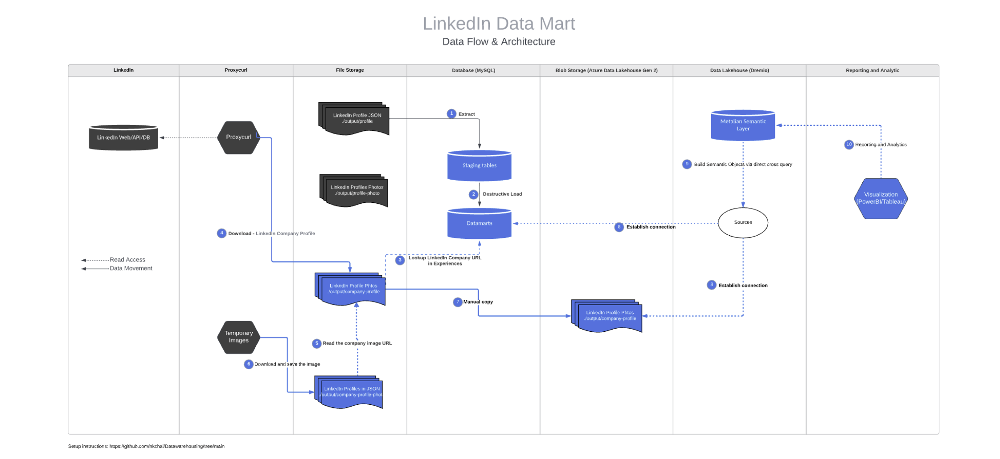

# LinkedIn Data Pipeline and Analytics Platform

A data warehouse solution for LinkedIn profile and company analytics using **Medallion Architecture** (Bronze → Silver → Gold).



---

## 🎯 Overview

This project extracts LinkedIn data via Proxycurl API, loads it into MySQL using Pentaho ETL, transforms data through Dremio's lakehouse layers, and visualizes insights in Power BI/Tableau.

**Key Highlight:** Company data is derived from profile experiences — we extract `company_linkedin_profile_url` from each profile's work history, then fetch company details and logos separately.

---

## 🏗️ Architecture

```
LinkedIn → Proxycurl API → JSON Files → Pentaho ETL → MySQL (Bronze)
                                                           ↓
                              Power BI/Tableau ← Dremio (Silver → Gold)
```

| Layer | Location | Purpose |
|-------|----------|---------|
| **Bronze** | MySQL | Raw data as extracted |
| **Silver** | Dremio | Cleaned & normalized |
| **Gold** | Dremio | Business-ready dimensional model |

---

## 📁 Project Structure

```text
LinkedIn-Data-Pipeline-And-Analytics-Platform/
│
├── ETL_transformations_profile/
│   └── Pentaho ETL transformation files
│
├── Extraction_Company/
│   └── Company data extraction workflows
│
├── data/
│   ├── companies/
│   └── profile_samples/
│
├── docs/
│   └── images/
│       └── architecture.png
│
├── .gitattributes
├── .gitignore
└── README.md
```

## 🔄 Data Flow

### How Company Data is Extracted

```
Profile JSON → Extract company_linkedin_profile_url from experiences
                              ↓
            Proxycurl Company API → Company JSON + Logo URLs
                              ↓
                    Download Company Photos
```

---

## 🗄️ Database Tables

| Table | Description |
|-------|-------------|
| `Demographic` | Profile basic info |
| `Education` | Education history |
| `Experiences` | Work history |
| `Certifications` | Professional certifications |
| `Languages` | Languages spoken |
| `Group_Memberships` | LinkedIn groups |
| `Honors_Awards` | Awards & recognition |
| `Projects` | Listed projects |
| `People_Also_Viewed` | Network connections |
| `Companies` | Company data |

---

## 🛠️ Tech Stack

| Component | Technology |
|-----------|------------|
| Data Source | LinkedIn via Proxycurl API |
| ETL Tool | Pentaho Data Integration |
| Database | MySQL |
| Cloud Storage | Azure Blob Storage |
| Data Lakehouse | Dremio |
| Visualization | Power BI / Tableau |

---

## ⚠️ Important Notes

### Pentaho Static Directory Issue

> **Problem:** Pentaho does not dynamically refresh directory contents. Any changes made to folders **after** opening Pentaho will NOT reflect in the application.

> **Solution:** Ensure all files are in the correct directory **before** opening Pentaho. If changes are needed:
> 1. Close Pentaho completely
> 2. Make directory/file changes
> 3. Reopen Pentaho

### Privacy & Security

- 🔒 **API keys are hidden** and not included in this repository
- 🔒 **Profile JSON files are anonymized** - Original profile data replaced with sample files for privacy
- 🔒 **Company JSON files are included** - Public company information is safe to share
- 🔒 Use `.env` file for credentials (see `.env.example`)

### Data Files

```
data/
├── companies/           ← Real company data (public information)
│   ├── accenture.json
│   ├── google.json
│   └── ...
└── profile_samples/             ← Anonymized sample profiles (fake data)
    ├── sample_profile_1.json
    ├── sample_profile_2.json
    └── sample_profile_3.json
```

> **Note:** Original profile JSON files contained personal information and have been replaced with anonymized sample files for data privacy compliance.

---

## Quick Start

```bash
# Clone repository
git clone https://github.com/hitipatel/LinkedIn-Data-Pipeline-And-Analytics-Platform.git

# Setup environment
cp .env.example .env
# Add your own credentials to .env

# Run Pentaho transformations
# Open Pentaho Spoon → Load .ktr/.kjb files → Execute
```

---

## Author

**Hiti Patel**

- GitHub: https://github.com/hitipatel

## Project Attribution

This project is based on an existing LinkedIn data pipeline implementation.

The current repository represents my own implementation and understanding
of the data extraction, ETL, transformation, and analytics workflow.

---
